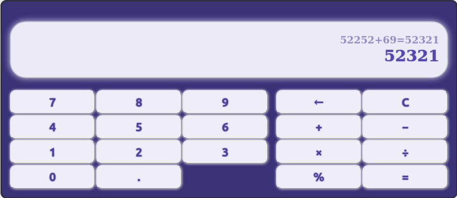

# Модуль F1 Итоговый проект

[Веб версия домашнего задания](https://skripkalisa.github.io/SF_PythonFS_Frameworks/F1/dist/)

## F1.8 Практическая работа

Практическое задание у вас в этом модуле, на первый взгляд, достаточно простое: вам нужно создать калькулятор.

Задание на самопроверку, поэтому уровень «реалистичности» вашей реализации калькулятора можете определять сами, но мы дадим пару подсказок для того, чтобы вы смогли наиболее полно исследовать изученные в модуле темы:

- для каждой кнопки калькулятора делайте отдельную кнопку в `HTML`;
- для отображения результата сделайте отдельный `div`;
- не присваивайте кнопкам разные смысловые функции, вычисляйте результат целиком.

## Screenshot

