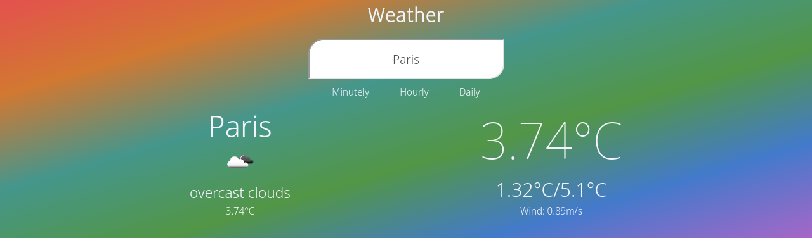
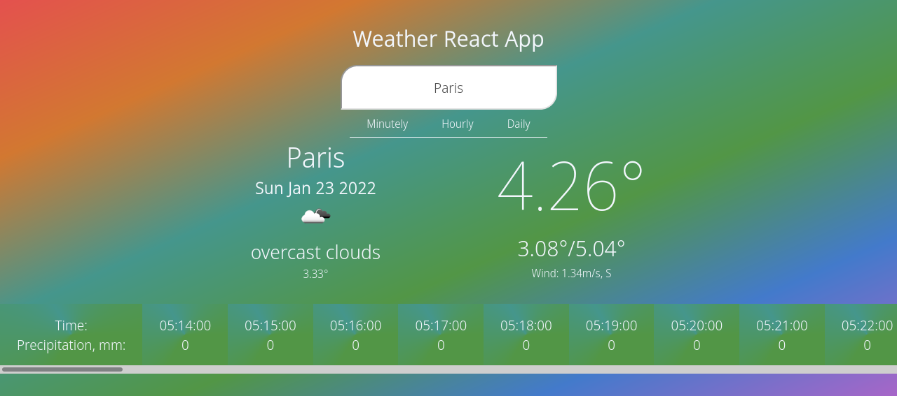
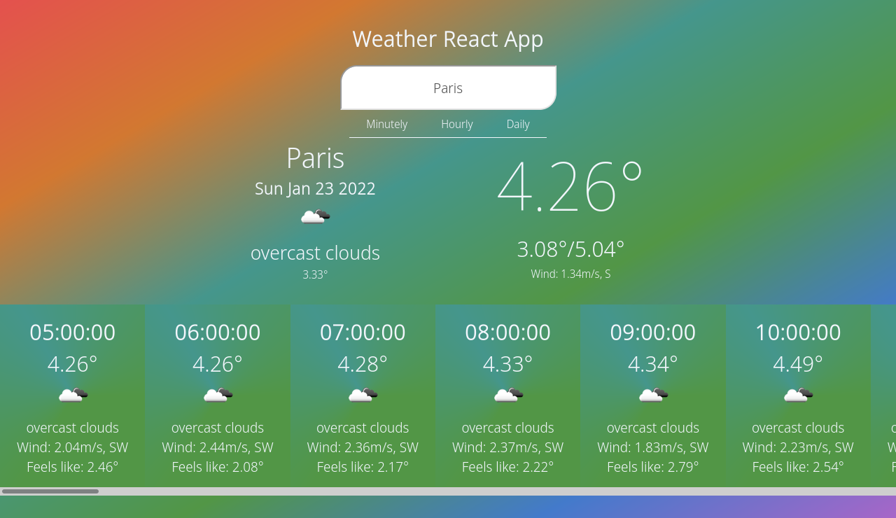
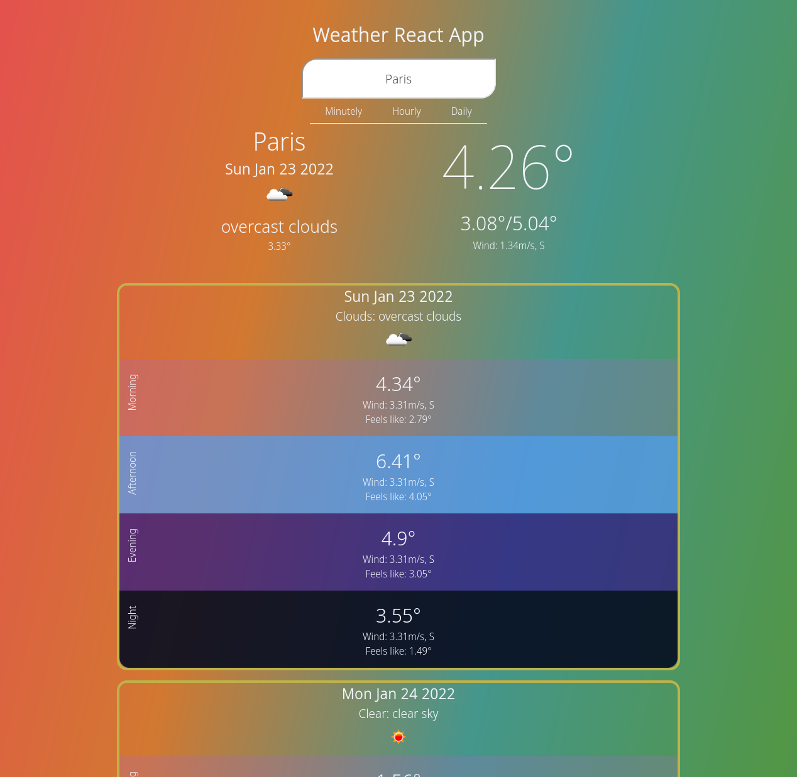

# Модуль F1 Практическое задание по теме «Основы React»

### [Веб версия домашнего задания](https://skripkalisa.github.io/SF_PythonFS_Frameworks/F1_hw/dist/)

## Задание

В этом модуле вас ждет небольшой проект, который позволит вам исследовать _React_ на примере, научиться писать свои компоненты и в целом освоиться с фреймворком.

Техническое задание на этот проект сформулировано следующим образом:

> Добрый день, Олег!
>
> Нам нужно создать простейший сервис просмотра информации о погоде.
>
> При создании сервиса нужно соблюсти следующие условия:
>
> 1. Необходимо использовать фреймворк _React_ и адаптивный дизайн, чтобы страница открывалась на любом _consumer-grade_ устройстве.
> 2. Пользователь должен либо иметь возможность выбрать из списка город, для которого ему нужен прогноз погоды.
> 3. Пользователь должен иметь возможность посмотреть данные на следующие временные промежутки:
>
>    - «сейчас» (поминутно на ближайший час);
>    - «ближайшие два дня» (почасово на двое суток);
>    - «на этой неделе» (следующие семь дней).
>
> 4. Данные должны запрашиваться через [One Call API OpenWeather](https://openweathermap.org/api)

## Screenshots

