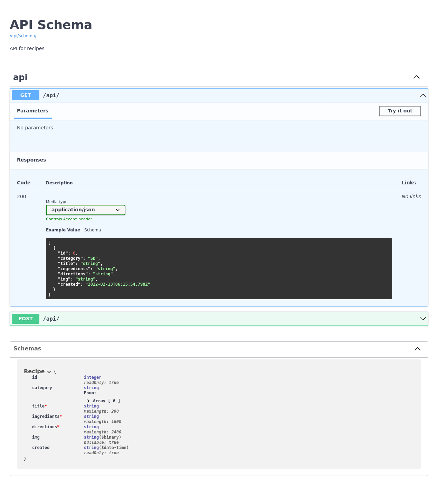

# Модуль F4 Практика React. Часть 2

## Задание

1. Создайте фуллстек-приложение с рецептами блюд, которое будет использовать _Django Rest Framework_, автодокументацию _OpenAPI_+_Swagger_ и _react-router_.
2. Давать пользователю возможность создавать рецепты не нужно: достаточно распределить их по категориям и отображать в клиенте и в _API_.
3. Где отображать документацию _API_ — решать вам.
4. У каждого блюда и каждой категории должна быть своя страница: с главной страницы можно перейти на любую из категорий, а из категории — на любой рецепт этой категории.

## Screenshots

