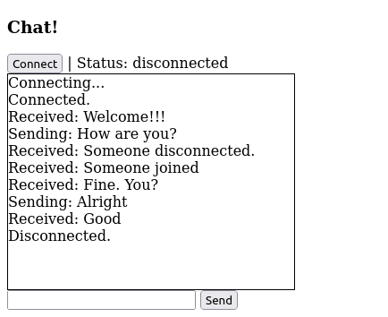
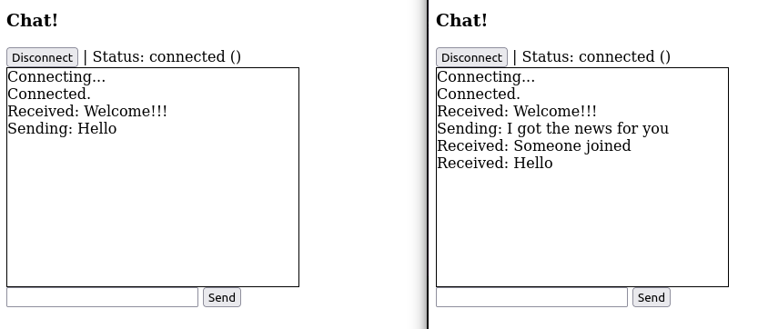

# Модуль F9 Клиент-серверное взаимодействие через веб-сокеты

### Как проверить

1. Установить виртуальное окружение командой:

   `python -m pip install -r reqs.txt`

2. Запустить сервер командой:

   `python3 server.py`

3. Открыть в браузере адрес:

   `http://0.0.0.0:8080`

## Задание

Напишите сервер на _aiohttp_, который:

- Позволяет клиентам подключиться через веб-сокеты на сообщения (новости).
- Может получать новые новости методом _POST/news_ (предположим, что этот запрос нам отправляет другой сервис) и рассылать всем подключившимся клиентам.
- Позволяет периодически проверять соединение между клиентом и сервером при помощи запросов, которые ничего не меняют.

Сделайте страницу, которая может отображать полученные от этого сервиса сообщения.

## Screenshots

